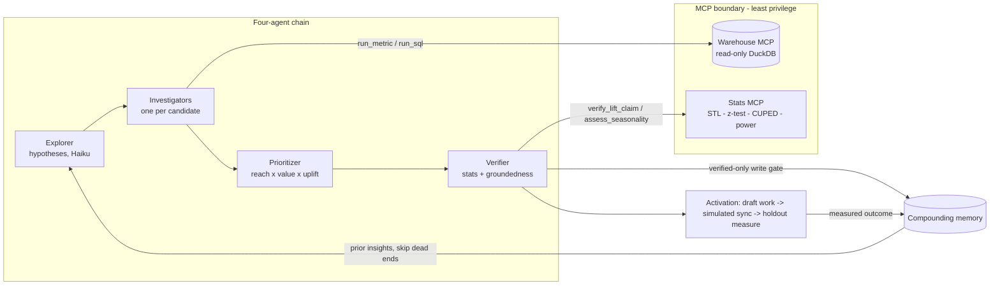

# Proofloop: Agentic CDP

Proofloop is a working prototype of a closed-loop customer data platform. It continuously analyzes warehouse data, ranks marketing opportunities, verifies incremental lift, drafts activation plans, and learns from measured outcomes.

Its core differentiator is **causal credibility**. Opportunities are ranked by **reach × value × incremental uplift**, rather than raw conversion, and each claim must pass a statistical holdout test plus a groundedness check before it can be promoted.

For a non-technical overview, read [`docs/EXPLAINER.md`](docs/EXPLAINER.md) or open `/how-it-works` in the web application.

> **Project status:** The agents, data queries, statistics, verifier, memory, and bandit are functional. Customer data is synthetic and includes a deterministic answer key in `packages/core/GROUND_TRUTH.md`. Campaign delivery and outcomes are simulated. The agent harness uses context engineering; the bandit is an independent decisioning component.

## Product loop

```
goal → discover ranked opportunities → draft audience and messaging
     → activate campaign → measure incremental lift with a holdout
     → optimize by segment → write verified outcomes to memory → improve the next run
```



## System boundaries

- **Agentic discovery:** a long-running, context-engineered agent harness that proposes and verifies opportunities.
- **Campaign generation:** an activation layer that compiles audiences, briefs, and message variants.
- **Decisioning:** a separate contextual bandit that selects message variants by segment.

## Architecture

| Component | Where | What |
|---|---|---|
| Synthetic warehouse | `packages/core/src/warehouse` | DuckDB, deterministic, planted ground truth (`GROUND_TRUTH.md`) |
| **Read-only Warehouse MCP** | `packages/core/src/mcp-warehouse` | `list_tables`/`get_schema`/`run_sql`/`run_metric` (semantic layer, errors out-of-scope)/`design_holdout`; audit log + result signatures |
| **Stats Verifier MCP** (Python) | `services/stats` | STL seasonality, two-proportion test, CUPED, power, `verify_lift_claim` |
| **Agent harness** | `packages/core/src/harness` | `make_plan`/`update_plan`, file-buffer scratchpad, subagents, model tiering, cost ledger |
| **Opportunity engine + Verifier** | `packages/core/src/engine` | explorer (hypotheses) → verify (stats gate + groundedness cross-check) → prioritize by reach×value×uplift; bare-LLM contrast; per-opportunity query provenance |
| Fan-out + guardrails | `packages/core/src/engine/fanout.ts`, `src/guardrails` | parallel Haiku classification; composable-context business rules |
| **Compounding memory** | `packages/core/src/memory` | typed multi-level insights, verified-only write gate, temporal validity |
| **Durable execution** | `packages/core/src/durable` | step-journaled checkpoints; crash-resume |
| Activation | `packages/core/src/activation` | audience compiler, creative brief, variant drafter, simulated connectors |
| Decisioning bandit | `packages/core/src/decisioning` | contextual Thompson sampling per segment (policy split: server learns, device selects) |
| Opportunity workspace UI | `apps/ui` | Next.js investigation chats, scoped Results, global current-truth inbox, share snapshots, `/api/bundle`, and `/api/ingest` |
| **Wire protocol** | `packages/protocol` | zod-only contract: decision bundle, events, forward-compat decoder, golden vectors |
| **Delivery SDK** | `packages/sdk` | on-device eligibility: predicate matcher, frequency ledger, adversarial-clock windows, durable event queue |
| Bundle compiler | `packages/core/src/delivery` | verified opportunity → decision bundle; per-tier posteriors; **parity test** (SQL engine vs device matcher) |
| Host app | `apps/device` | Expo/React Native retail app: ~15-line init, host-owned rendering, live DebugPanel |

See [`docs/ARCHITECTURE.md`](docs/ARCHITECTURE.md) for the top-down technical walkthrough, [`docs/DESIGN_DECISIONS.md`](docs/DESIGN_DECISIONS.md) for the build-vs-buy rationale, and [`docs/FANOUT_VS_RAG.md`](docs/FANOUT_VS_RAG.md).

## Delivery architecture

Discovery is only useful if a verified opportunity can be delivered safely. The delivery path compiles approved work into a portable decision bundle, evaluates eligibility on-device, enforces frequency limits, and returns durable delivery receipts to the backend. Brand, tone, and seasonality remain judgment rules; frequency limits are enforced deterministically in code on both sides of the wire.

```mermaid
flowchart LR
  V[Verified opportunity<br/>+ guardrail-cleared creative] --> C[compile<br/>packages/core/src/delivery]
  C -->|GET /api/bundle<br/>ETag + X-Server-Time| SDK[@lift/sdk<br/>evaluateBundle - pure, sync]
  SDK -->|renders arm| HOST[Host app<br/>apps/device]
  SDK -->|durable queue<br/>POST /api/ingest| ING[ingest: dedupe by batch_id]
  ING -->|observed_delivery| M[(Memory)]
  M -->|next explorer run| V
```

The same problem deliberately looks different on each side, and the contract matters as much as the code:

- **One predicate, two evaluators.** Audience predicates are canonical (`{column, op, value}` + `all/any/not`, the semantic layer's operator set). The server compiles them to SQL; the device evaluates them with `matchPredicate`. `delivery/parity.test.ts` runs **both over the real `customer_360` rows** and requires identical membership - a differential test, not a function equalling itself.
- **One cap, two machines.** Server side it's a `GROUP BY` over `campaign_sends` anchored on `MAX(sent_at)`; device side it's a persisted ledger with **monotonic-clock windows**. `evaluateBundle` is pure (golden vectors are deterministic), so "now" is injected - as a value with structure: `{wallMs, monotonicMs, bootId, skewMs}`. Same boot → monotonic elapsed (rolling the date forward 8 days does not un-cap you); across boots → skew-corrected wall time (anchored off `X-Server-Time` on every response); ambiguity → suppress, never show.
- **Clients you can't force-update.** `decodeBundle` skips a campaign it cannot understand - recorded reason, no crash, no silent false - so a newer server never breaks an older app.
- **Batching that owns its losses.** The queue persists before flushing, deletes only on ack, retries a sealed batch under the same id (the server dedupes by file existence), and when the bounded buffer overflows it **reports** `dropped_since_last_batch` instead of hiding it.
- **The uplink.** Ingest folds decision receipts into per-opportunity aggregates and writes them to Memory as `observed_delivery` under `<KEY>#delivery` - a counted observation, not an inference, and namespaced so it can never clobber the Verifier's insight. The next explorer run reads a fact only the device could have known: *"suppressed N in-app impressions under frequency_cap"*.

Current scope is limited to in-app delivery. Production push delivery requires APNs or FCM integration, and the device bundle/ingest boundary still requires per-device credentials even when the investigation workspace uses Supabase Auth. Activation artifacts remain explicitly marked with `"simulated": true`. The `@lift/sdk` runtime depends only on `@lift/protocol`; an import-graph test prevents Node-only dependencies from entering the Hermes bundle.

```bash
pnpm ui:dev                                      # dashboard at localhost:3000
pnpm device:dev                                  # build protocol and SDK, then start Expo
EXPO_PUBLIC_LIFT_API=http://<LAN-IP>:3000 ...    # point a physical device at the dashboard
```
Watch the DebugPanel: first Home visit renders an arm; the second is suppressed (`frequency_cap:session_1`); airplane mode queues events durably; reconnecting flushes exactly N; the dashboard's Memory page gains the `observed_delivery` fact.

## Agent responsibilities

- **Independent verification.** Statistical verdicts come from scipy and statsmodels in a separate Python service. A demote-only LLM groundedness check in `engine/groundedness.ts` can remove an unsupported claim but can never promote one.
- **Context isolation.** Each investigator gets one objective and returns a concise summary, which keeps long-running investigations focused.
- **Cost tiering per role.** Breadth (Explorer, fan-out, judges) runs on Haiku; orchestration/reasoning runs on Sonnet. One prompt = one model = paying reasoning prices for enumeration.
- **Inspectable ranking.** The Prioritizer uses explicit arithmetic in `engine/prioritize.ts`: `reach × value × verified uplift`. Every ranking can be audited numerically.

## Scaling considerations

The main constraints, in expected order of impact, are:
1. **`runAndReadAll` materializes full results server-side** before the 1,000-row cap - a streaming reader with a pushed-down `LIMIT` is the fix.
2. **Single-file DuckDB behind one MCP server process** - becomes a real warehouse (Snowflake/BigQuery) with a connection pool; the MCP contract is the part that survives.
3. **The device delivery API has no workspace connector registry** - production needs authenticated per-workspace bundle and ingest routing.
4. **The open-ended LLM harness is less resumable than the investigation engine** - investigation runs checkpoint explorer, candidate, and ranking stages, but arbitrary harness scratchpad/tool state would need its own versioned checkpoint contract.
5. **Streaming narration is sequential** for legibility; the batch path already verifies in parallel, but a parallel *stream* needs per-key event correlation in every consumer.
6. **Memory is a table scan** - fine at hundreds of insights, needs indexing + retrieval ranking at millions.

## Future improvements

- **Provenance-first.** Query fingerprints were retrofitted in a later pass; designing every claim as `(claim, evidence, fingerprint)` from day one is cheaper and stricter.
- **Event-sourced store** instead of a latest-run JSON blob - replay, audit, and multi-run history for free.
- **Semantic layer as the only default surface**, `run_sql` behind an explicit flag - the guarded fallback still gets reached before the governed path more often than it should.
- **Journal the harness from the start** rather than proving durability on the deterministic pipeline first.
- **One shared candidate-source module** - the engine, the streaming wrapper, and the durable runner each assemble the same candidate list; that's three places to forget one.

## Quick start

### Prerequisites

- Node.js 20 or later
- pnpm 9.15.2
- Python 3.11 or later
- [uv](https://docs.astral.sh/uv/)

```bash
pnpm run setup        # install Node + Python (uv) deps (`run` avoids pnpm's own `setup` command)
pnpm seed             # build the synthetic warehouse + plant ground truth
pnpm ground-truth     # prove the planted signals are recoverable (10/10)

# Commands marked "API key" require ANTHROPIC_API_KEY in .env.
pnpm opportunities    # ranked board and bare-LLM contrast (API key)
pnpm demo             # live agent harness trace (API key)
pnpm fanout           # Haiku fan-out classifier and guardrails (API key)
pnpm durable          # compounding memory + crash-resume (no key)
pnpm activate         # draft work, simulated activation, measured lift (API key)
pnpm bandit           # decisioning bandit (no key)

pnpm board:data       # regenerate demo fixtures (API key)
pnpm ui:dev           # run the web app at localhost:3000
pnpm device:dev       # run the Expo host app against the dashboard

pnpm verify           # automated suite: build (core+ui) + typecheck + unit tests + stats tests
```
*If Sonnet 4.6 is congested, prefix `MODEL_REASONING=claude-haiku-4-5-20251001` - the harness also auto-falls back to Haiku.*

## Verification scenarios

All of these are asserted by exit-code gates (`pnpm ground-truth`, `pnpm opportunities`, `pnpm durable`), not just claimed; exact realized numbers live in `packages/core/GROUND_TRUTH.md` and regenerate with the seed:
- **Catches the trap:** the VIP campaign (~42% raw conversion) has ~0 incremental lift (CI includes 0) → demoted; the bare LLM accepts it ("42% conversion is exceptional - scale it").
- **Proves seasonality instead of guessing at it:** shown the raw Q4 spike, the bare LLM can only hedge - "can't tell without the baseline" (an honest empirical finding: modern LLMs know seasonality *exists* but can't *check* it). The Verifier has the series and the statistics: STL attributes ~100% of the spike to the seasonal component and rejects it with numbers. Awareness isn't verification - both sides run on one command.
- **Ranks ≥3 proven opportunities** (second-purchase SMS, spring product-drop creative, cross-category cross-sell), each with lift + p-value, groundedness-checked, and full query provenance stored on the opportunity.
- **Compounds:** run 2 skips the killed trap from memory (and re-verifies stale dead-ends past 14 days); crash-resume replays journaled steps; the bandit beats "human marketing" by ~20%.

## Web application

`apps/ui` is a Next.js workspace for defining a goal, running an investigation, reviewing verified opportunities, approving activation work, and measuring outcomes. Primary screens include Dashboard, Opportunities, Investigations, Activity, Launched & Measuring, Insights, and Settings.

The application supports persistent investigation chats, a per-chat Results
drawer, a workspace-wide latest-truth inbox, background runs, and immutable
revocable share snapshots. See [`docs/MULTIPLE_INVESTIGATIONS.md`](docs/MULTIPLE_INVESTIGATIONS.md)
for the product model, Supabase schema, worker process, and migration workflow.
The cookie-based Supabase adapter is isolated behind two modules and
`@supabase/ssr` is exact-version pinned while that API remains beta.

One env flag (`LIFT_MODE`) swaps the data source behind an identical UI:

- **`demo`** (default) - deterministic, instant, $0, no API/Python. Reads the `board.json` fixture and scripts the streamed activity. Deployable to Vercel; the shareable artifact.
- **`live`** - the real `@lift/core` engine, streamed over SSE (Server-Sent Events). Runs a real ~45s discovery, persists it, and renders the same UI.

```bash
pnpm ui:dev                          # demo mode (no key) → localhost:3000
LIFT_MODE=live pnpm ui:dev           # live mode (needs ANTHROPIC_API_KEY + the seeded warehouse)
```

## Deploy

- **Demo on Vercel:** run `vercel`. The included `vercel.json` uses `LIFT_MODE=demo`, which does not require an API key or Python runtime.
- **Live web and durable worker:** configure Supabase, build the image, then run
  `docker compose -f docker-compose.worker.yml up`. The web process serves
  Next.js; the long-lived worker owns leased assistant and engine jobs.
