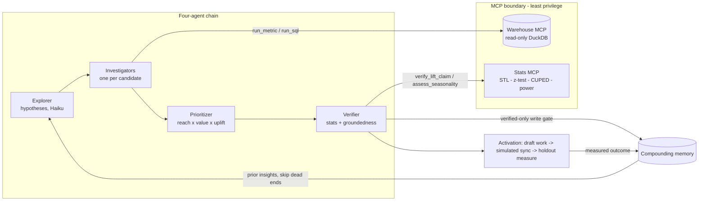

# Lift Compass — a causally-credible Agentic CDP

A working prototype of the [Agentic CDP](https://hightouch.com/blog/the-agentic-cdp) Hightouch announced in June 2026: agents that run continuously and hand a marketer a short, **ranked, proven** list of opportunities with draft work — instead of a blank canvas.

Its differentiator is **causal credibility**: it ranks opportunities by **reach × value × incremental uplift** (not raw conversion) and **proves each one with a holdout**. A separable **Verifier** rejects anything the data can't support — and visibly catches a planted trap that a normal LLM falls for.

> **New here? Read [`docs/EXPLAINER.md`](docs/EXPLAINER.md)** (plain language, no jargon), or open the `/how-it-works` page in the UI.

> **Prototype, not a product.** The agents, data queries, statistics, verifier, memory, and bandit are **real and working**. The customer data is **synthetic** (with a known answer key, so results are *provably* correct — see `packages/core/GROUND_TRUTH.md`). Campaign sending and outcomes are **simulated**. The harness is **context-engineering, not RL** — the bandit is a separate AI-Decisioning analog.

## The loop (closed)

```
goal → discover ranked opportunities → draft work (audience + messaging + creative brief)
     → AMP-analog assets → (simulated) activation → measure incremental lift with a holdout
     → optimize the per-segment message (bandit) → write verified outcomes to memory → smarter next run
```



## Three Hightouch systems, kept distinct
- **Agentic CDP** — the long-running, context-engineered agent harness (what this mirrors).
- **AMP** (Agentic Marketing Platform) — turns ideas into campaign assets (a thin analog: brief + variant drafter).
- **AI Decisioning** — a *separate* RL/bandit product (analogized in `packages/core/src/decisioning`, never conflated with the harness).

## Architecture

| Component | Where | What |
|---|---|---|
| Synthetic warehouse | `packages/core/src/warehouse` | DuckDB, deterministic, planted ground truth (`GROUND_TRUTH.md`) |
| **Read-only Warehouse MCP** | `packages/core/src/mcp-warehouse` | `list_tables`/`get_schema`/`run_sql`/`run_metric` (semantic layer, errors out-of-scope)/`design_holdout`; audit log + result signatures |
| **Stats Verifier MCP** (Python) | `services/stats` | STL seasonality, two-proportion test, CUPED, power, `verify_lift_claim` |
| **Agent harness** | `packages/core/src/harness` | `make_plan`/`update_plan`, file-buffer scratchpad, subagents, model tiering, cost ledger |
| **Opportunity engine + Verifier** | `packages/core/src/engine` | explorer (hypotheses) → verify (stats gate + groundedness cross-check) → prioritize by reach×value×uplift; bare-LLM contrast; per-opportunity query provenance |
| Fan-out + guardrails | `packages/core/src/engine/fanout.ts`, `src/guardrails` | parallel Haiku classification; composable-context business rules |
| **Compounding memory** | `packages/core/src/memory` | typed multi-level insights, verified-only write gate, temporal validity |
| **Durable execution** | `packages/core/src/durable` | step-journaled checkpoints; crash-resume |
| Activation + AMP-analog | `packages/core/src/activation` | audience compiler, creative brief, variant drafter, simulated connectors |
| AI-Decisioning bandit | `packages/core/src/decisioning` | contextual Thompson-sampling per segment |
| Opportunity board UI | `apps/ui` | Next.js static board + `/how-it-works` |

See [`docs/ARCHITECTURE.md`](docs/ARCHITECTURE.md) for the top-down technical walkthrough, [`docs/DESIGN_DECISIONS.md`](docs/DESIGN_DECISIONS.md) for the build-vs-buy rationale, and [`docs/FANOUT_VS_RAG.md`](docs/FANOUT_VS_RAG.md).

## Why four agents (not one prompt)

- **The Verifier must be adversarial, and a prompt can't argue with itself.** Ours doesn't even run on tokens: verdicts come from scipy/statsmodels in a separate Python service, plus a demote-only LLM groundedness cross-check (`engine/groundedness.ts`) that can pull a claim *out* of the ranked list but never wave one in. Two independent checks, different failure modes.
- **Context isolation.** Each investigator gets one objective and returns a summary — a single 24-turn prompt investigating eight candidates rots its own context long before candidate eight.
- **Cost tiering per role.** Breadth (Explorer, fan-out, judges) runs on Haiku; orchestration/reasoning runs on Sonnet. One prompt = one model = paying reasoning prices for enumeration.
- **Inspectable ranking.** The Prioritizer is arithmetic in `engine/prioritize.ts` — `reach × value × verified uplift` — not vibes inside a prompt. You can defend every rank number-by-number.

## What breaks at 100× scale

Honest list, in the order it would hurt:
1. **`runAndReadAll` materializes full results server-side** before the 1,000-row cap — a streaming reader with a pushed-down `LIMIT` is the fix.
2. **Single-file DuckDB behind one MCP server process** — becomes a real warehouse (Snowflake/BigQuery) with a connection pool; the MCP contract is the part that survives.
3. **The JSON-file app store and in-process run lock** (`apps/ui/src/server/store.ts`) — becomes Postgres + a queue.
4. **The LLM harness isn't step-journaled** — the deterministic engine pipeline is (`durable/journal.ts`), the open-ended harness loop is not; at scale you'd externalize plan + scratchpad pointers + transcript per checkpoint into Inngest/DBOS (documented gap, see `docs/ARCHITECTURE.md`).
5. **Streaming narration is sequential** for legibility; the batch path already verifies in parallel, but a parallel *stream* needs per-key event correlation in every consumer.
6. **Memory is a table scan** — fine at hundreds of insights, needs indexing + retrieval ranking at millions.

## What I'd do differently

- **Provenance-first.** Query fingerprints were retrofitted in a later pass; designing every claim as `(claim, evidence, fingerprint)` from day one is cheaper and stricter.
- **Event-sourced store** instead of a latest-run JSON blob — replay, audit, and multi-run history for free.
- **Semantic layer as the only default surface**, `run_sql` behind an explicit flag — the guarded fallback still gets reached before the governed path more often than it should.
- **Journal the harness from the start** rather than proving durability on the deterministic pipeline first.
- **One shared candidate-source module** — the engine, the streaming wrapper, and the durable runner each assemble the same candidate list; that's three places to forget one.

## Quick start

```bash
pnpm setup            # install Node + Python (uv) deps
pnpm seed             # build the synthetic warehouse + plant ground truth
pnpm ground-truth     # prove the planted signals are recoverable (10/10)

# Each phase is independently runnable (★ = needs ANTHROPIC_API_KEY in .env):
pnpm opportunities ★  # ranked board + bare-LLM contrast (the differentiator)
pnpm demo          ★  # the live agent harness trace
pnpm fanout        ★  # Haiku fan-out classifier + guardrails
pnpm durable          # compounding memory + crash-resume (no key)
pnpm activate      ★  # draft work → simulated activation → measured lift
pnpm bandit           # AI-Decisioning bandit (no key)

pnpm board:data    ★  # regenerate the demo fixture (apps/ui/public/board.json)
pnpm ui:dev           # the product app at localhost:3000 (demo mode — instant, no key)

pnpm verify           # automated suite: build (core+ui) + typecheck + unit tests + stats tests
```
*If Sonnet 4.6 is congested, prefix `MODEL_REASONING=claude-haiku-4-5-20251001` — the harness also auto-falls back to Haiku.*

## What it proves (vs. the ground-truth answer key)
All of these are asserted by exit-code gates (`pnpm ground-truth`, `pnpm opportunities`, `pnpm durable`), not just claimed; exact realized numbers live in `packages/core/GROUND_TRUTH.md` and regenerate with the seed:
- **Catches the trap:** the VIP campaign (~42% raw conversion) has ~0 incremental lift (CI includes 0) → demoted; the bare LLM accepts it ("42% conversion is exceptional — scale it").
- **Proves seasonality instead of guessing at it:** shown the raw Q4 spike, the bare LLM can only hedge — "can't tell without the baseline" (an honest empirical finding: modern LLMs know seasonality *exists* but can't *check* it). The Verifier has the series and the statistics: STL attributes ~100% of the spike to the seasonal component and rejects it with numbers. Awareness isn't verification — both sides run on one command.
- **Ranks ≥3 proven opportunities** (second-purchase SMS, spring product-drop creative, cross-category cross-sell), each with lift + p-value, groundedness-checked, and full query provenance stored on the opportunity.
- **Compounds:** run 2 skips the killed trap from memory (and re-verifies stale dead-ends past 14 days); crash-resume replays journaled steps; the bandit beats "human marketing" by ~20%.

## The product app (Lift Compass UI)

`apps/ui` is a Next.js app — the marketer's "Opportunity Inbox": pick a goal → run discovery → watch the agents work → review proven opportunities → approve & launch → see measured results. Screens: Opportunities, Activity, Launched & Measuring, Memory, Settings.

One env flag (`LIFT_MODE`) swaps the data source behind an identical UI:
- **`demo`** (default) — deterministic, instant, $0, no API/Python. Reads the `board.json` fixture and scripts the streamed activity. Deployable to Vercel; the shareable artifact.
- **`live`** — the real `@lift/core` engine, streamed over SSE (Server-Sent Events). Runs a real ~45s discovery, persists it, and renders the same UI.

```bash
pnpm ui:dev                          # demo mode (no key) → localhost:3000
LIFT_MODE=live pnpm ui:dev           # live mode (needs ANTHROPIC_API_KEY + the seeded warehouse)
```

## Deploy

- **Demo → Vercel** (the shareable URL): `vercel` (uses `vercel.json`; `LIFT_MODE=demo`, no key, no Python). The live engine never loads, so no native deps are needed at runtime.
- **Live → one container**: `docker build -t lift-compass . && docker run -e ANTHROPIC_API_KEY=... -p 3000:3000 lift-compass` (the `Dockerfile` installs Node 20 + Python 3.11 + uv, seeds the warehouse, and runs `LIFT_MODE=live next start`). Put it behind basic auth before exposing publicly.
